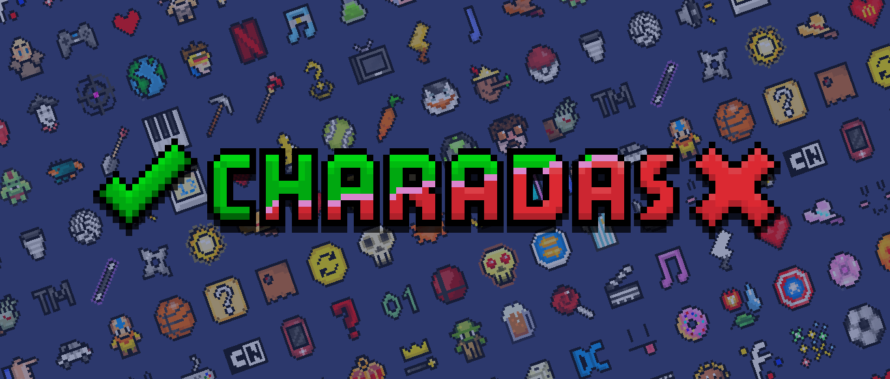
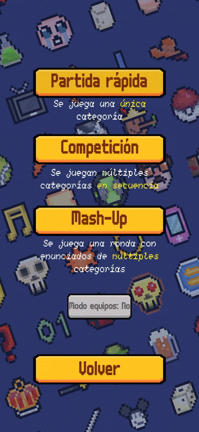

  

  
  
  

# English
Charades is a party game developed in Unity for Android devices (with support for PC versions as well).
## Features:
- Play the classic game about guessing a word or thing with help of one or more friends in over 100 different categories: from classics such as Animals to more specific categories, such as characters from a video game.
- Multiple control schemes for mobile devices: Answer using either the gyroscope or your phone's touchscreen (or both)
- Three game modes: Play a quick round in a single category, a selection of rounds in a row, or even mashup many categories in a single chaotic round.
- Built-in 1v1 team mode. Compete head-to-head to see which team gets more points.
- Custom category support, with a built-in creator within the app. You can load and share categories easily.

## Notes:
- The game makes use of music tracks from [Three Red Hearts: Prepare to Dev](https://tallbeard.itch.io/three-red-hearts-prepare-to-dev) by [Abstraction](https://abstractionmusic.com/).
- Sound effects created using [ChipTone](https://sfbgames.itch.io/chiptone), by Tom Vian.
- The fonts used in the game are [m6x11plus](https://managore.itch.io/m6x11) by Daniel Linssen, and [monogram](https://datagoblin.itch.io/monogram) by datagoblin.
- Some icons use the following assets with modifications:
  - [16x16 Puny Characters](https://merchant-shade.itch.io/16x16-puny-characters) by Shade
  - [Free 16x16 Miniworld Sprites](https://merchant-shade.itch.io/16x16-mini-world-sprites) by Shade and octoshrimpy
  - [Coins & Gems & Chests & More](https://greatdocbrown.itch.io/coins-gems-etc) by greatdocbrown
  - [Chess Pieces 16x16 One-bit](https://berryarray.itch.io/chess-pieces-16x16-one-bit) by BerryArray
- Everything listed beforehand has a CC0 License.
- UI currently in Spanish only.

# Español

Charadas es un juego casual desarrollado en Unity para dispositivos Android (con soporte para versiones de PC).
## Características:
- Juega al clásico juego de adivinar una palabra o el nombre de algo con ayuda de uno o más amigos, a través de más de 100 categorías: desde clásicos como "Animales" hasta categorías más específicas, como personajes de algún videojuego en particular.
- Múltiples modos de control en dispositivos móviles: Contesta usando el giroscopio o la pantalla táctil (o ambos)
- Tres modos de juego: Juega una partida rápida con una sola categoría, una selección de categorías en sucesión, o incluso combina varias categorías en una única y caótica ronda.
- Modo equipos incorporado: Compite para ver qué equipo consigue más puntos.
- Soporte para categorías personalizadas, con creador incluido en la aplicación. Se pueden cargar y compartir categorías con facilidad.

## Aclaraciones:
- El juego utiliza canciones del álbum [Three Red Hearts: Prepare to Dev](https://tallbeard.itch.io/three-red-hearts-prepare-to-dev) by [Abstraction](https://abstractionmusic.com/).
- Efectos de sonido creados con la herramienta [ChipTone](https://sfbgames.itch.io/chiptone), de Tom Vian.
- Las fuentes utilizadas en el juego son [m6x11plus](https://managore.itch.io/m6x11) de Daniel Linssen, y [monogram](https://datagoblin.itch.io/monogram) de datagoblin.
- Algunos íconos del juego utilizan los siguientes recursos modificados:
  - [16x16 Puny Characters](https://merchant-shade.itch.io/16x16-puny-characters) by Shade
  - [Free 16x16 Miniworld Sprites](https://merchant-shade.itch.io/16x16-mini-world-sprites) by Shade and octoshrimpy
  - [Coins & Gems & Chests & More](https://greatdocbrown.itch.io/coins-gems-etc) by greatdocbrown
  - [Chess Pieces 16x16 One-bit](https://berryarray.itch.io/chess-pieces-16x16-one-bit) by BerryArray
- Todo lo listado previamente tiene una licencia CC0 o equivalente.
- Interfaz actualmente sólo en Español.

<a href="https://creativecommons.org">Charadas</a> © 2025 by <a href="https://creativecommons.org">Felipe Arroyo</a> is licensed under <a href="https://creativecommons.org/licenses/by-nc-sa/4.0/">CC BY-NC-SA 4.0</a>

